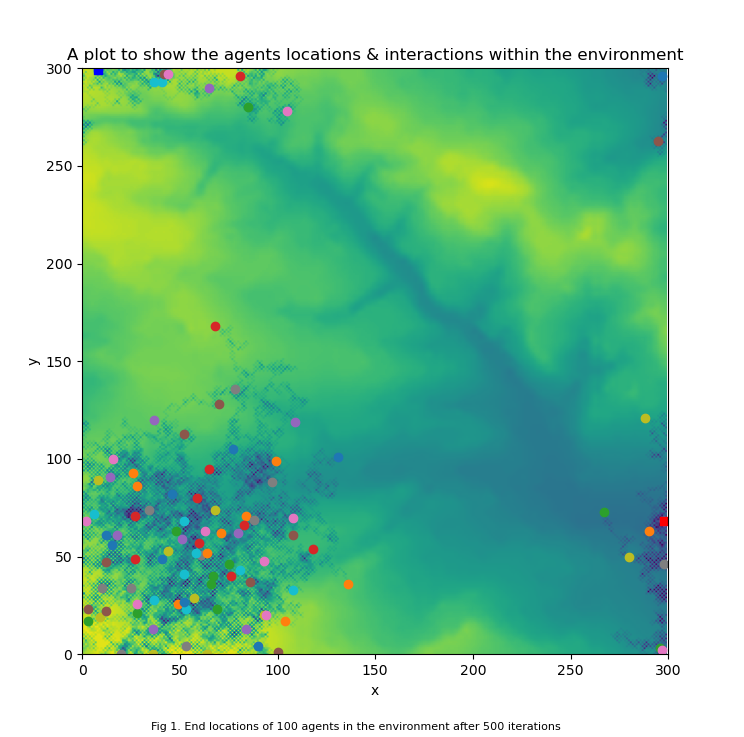

<form action="https://sickotra.github.io/">
    <input type="submit" style = "
  border: ridge #4780D5; /* Blue */
  color: black;
  background-color: #FFD700; /* Yellow */                                
  padding: 10px 15px;                               
  text-align: center;
  text-decoration: none;
  display: inline;
  font-size: 16px;
  margin: 4px 2px;
  width: 100px
  cursor: pointer;" value="Home" />
</form>

<form action="https://sickotra.github.io/Projects/projects">
    <input type="submit" style = "
  border: ridge #4780D5; /* Blue */
  color: black;
  background-color: #FFD700; /* Yellow */                                
  padding: 10px 15px;                               
  text-align: center;
  text-decoration: none;
  display: inline;
  font-size: 16px;
  margin: 4px 2px;
  width: 100px
  cursor: pointer;" value="Projects" />
</form>

<form action="https://sickotra.github.io/maths">
    <input type="submit" style = "
  border: ridge #4780D5; /* Blue */
  color: black;
  background-color: #FFD700; /* Yellow */                                
  padding: 10px 15px;                               
  text-align: center;
  text-decoration: none;
  display: inline;
  font-size: 16px;
  margin: 4px 2px;
  width: 100px
  cursor: pointer;" value="Maths Blog" />
</form>

<form action="https://sickotra.github.io/cv">
    <input type="submit" style = "
  border: ridge #4780D5; /* Blue */
  color: black;
  background-color: #FFD700; /* Yellow */                                
  padding: 10px 15px;                               
  text-align: center;
  text-decoration: none;
  display: inline;
  font-size: 16px;
  margin: 4px 2px;
  width: 100px
  cursor: pointer;" value="CV" />
</form>

 

 
   
----------------------------------------------

# Projects

### Programming for Social Science Sept-Oct 2020
In this project a simple agent-based model is created and the interactions of agents, with each other and the environment they live in, are simulated. These agents have various behaviours such as move, eat and sharing resources.

 
<figure>

</figure>

  <i> See the [ABM Github Repository](sickotra/Programming_Practicals) for more information and the code used to build the program. </i>
           
                  
### Bacterial Bomb Oct 2020
A deadly biological weapon has been detonated in the middle of the town on top of a building. As a member of a secret government anti-terrorist untit, this program has been built to model the spread of the contagious bacterial particles. This will allow the bacteria to be traced so that the contamination can be dealt with. 
  <i> See the [Bacterial Bomb Github Repository](Bacterial_Bomb) for more information and the code used to build the program. </i>

